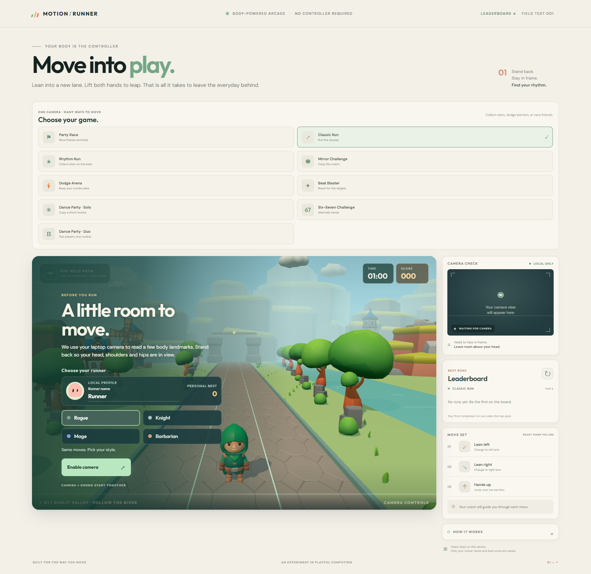
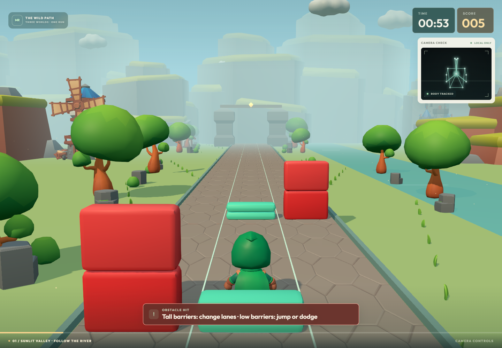
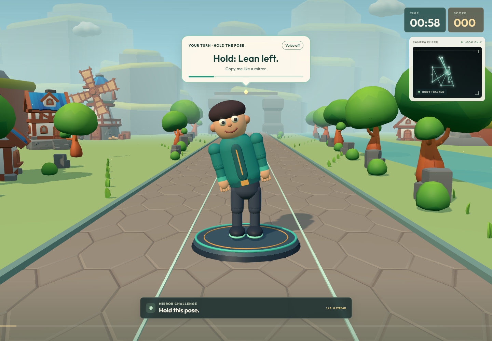
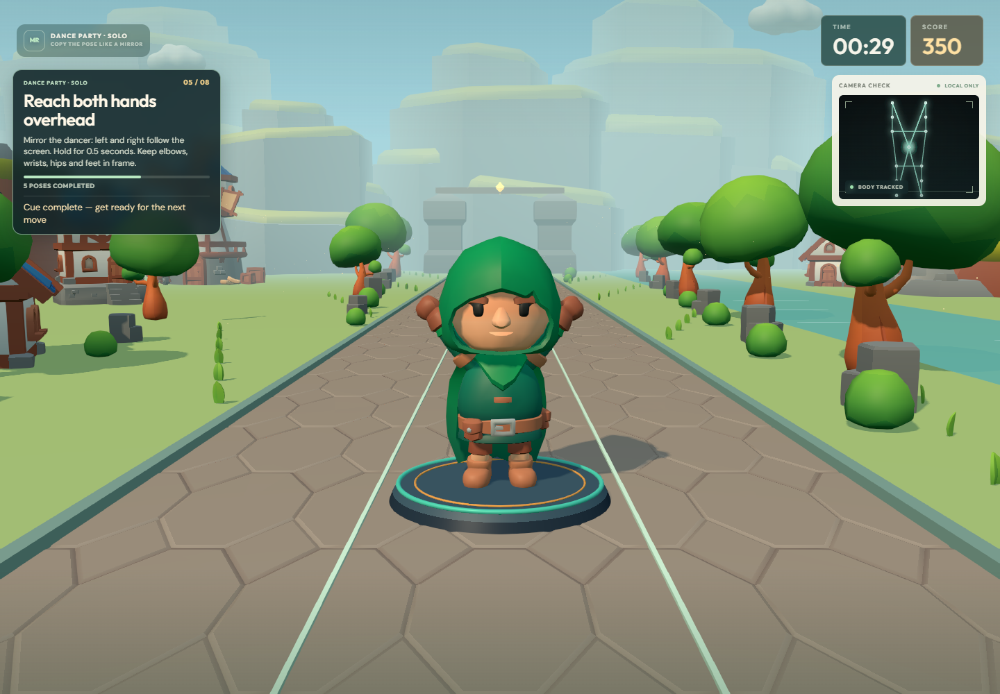
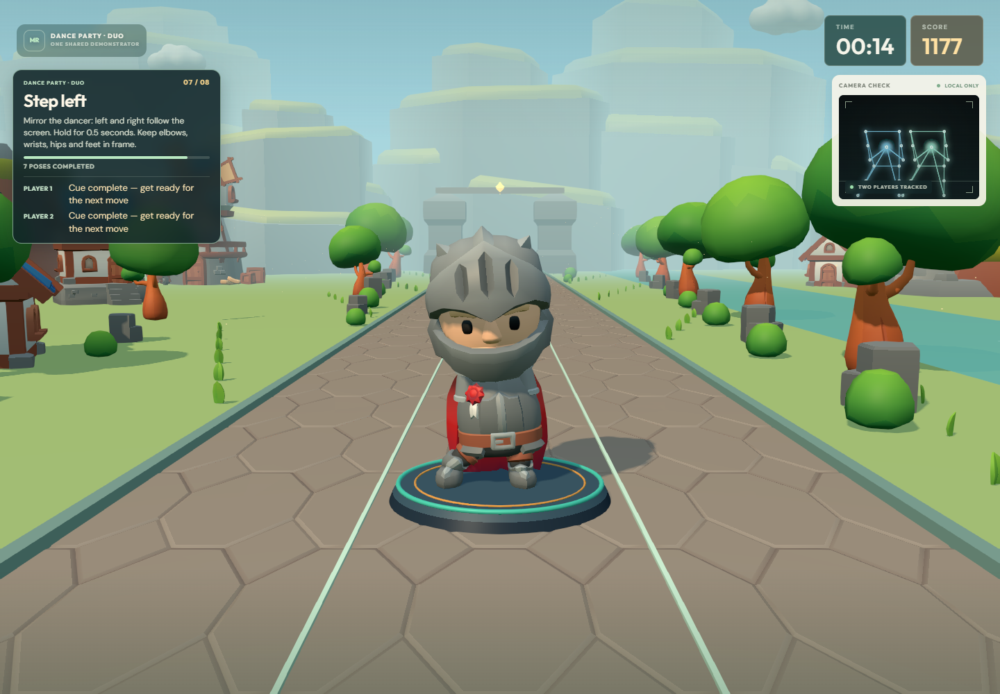
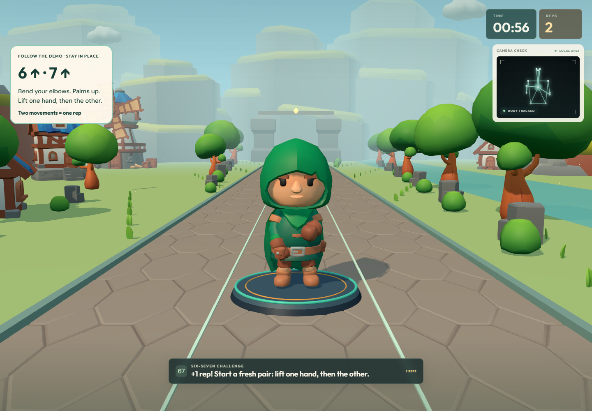
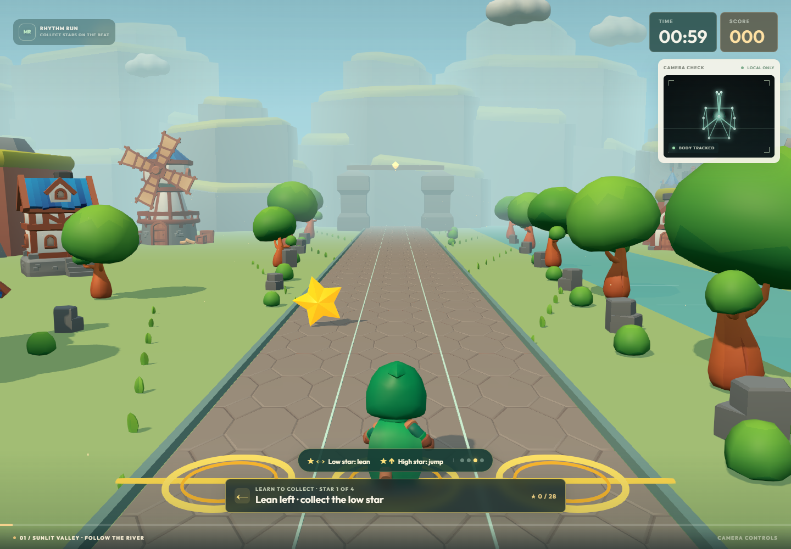
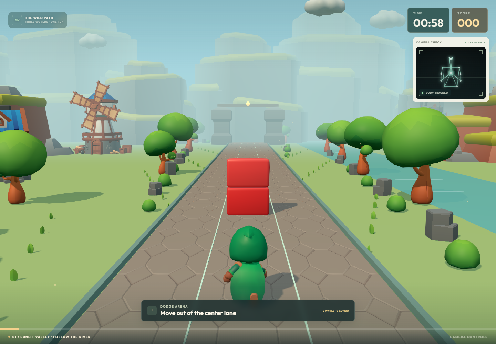
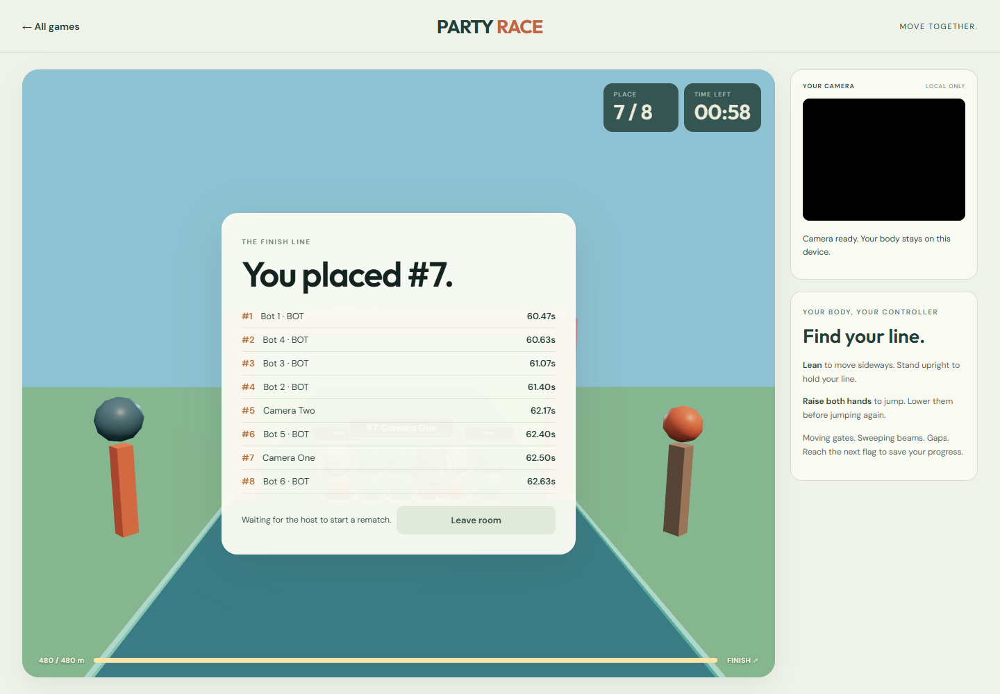
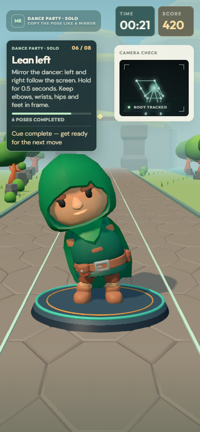

# Motion Runner

Motion Runner is a browser arcade controlled by an ordinary webcam. It turns body movement into game input: lean to steer, raise your hands to jump, copy a coach, reach for targets, dance through a routine, or race with friends. No gamepad or special sensor is required.

**[Play the browser demo](https://feruum.github.io/motion-runner/)** · **[Browse the source](https://github.com/Feruum/motion-runner)** · [Third-party notices](./THIRD_PARTY_NOTICES.md)

The main scenario is a complete 60-second run: the player enables the camera, calibrates a neutral stance, learns the gestures, steers around obstacles, receives movement feedback, and reaches a results screen with score and replay. Other modes reuse the same camera pipeline with their own rules and goals.

The project is a Bun workspace. The Vite/TypeScript client runs pose recognition in the browser, the custom game package interprets landmarks and scores actions, and an optional Bun/Hono API serves multiplayer rooms and leaderboard storage. Camera video and pose landmarks stay on the device.

<p align="center">
  
</p>

## Game gallery

The gallery shows captures of the game UI. The small camera preview contains generated test landmarks for repeatable browser checks; it is not a recording of a player.

<p align="center"><strong>Classic Run — avoid an obstacle and follow the correction cue</strong><br>
</p>

<table>
  <tbody>
    <tr>
      <td width="50%" align="center"><strong>Mirror Challenge</strong><br></td>
      <td width="50%" align="center"><strong>Dance Party · Solo</strong><br></td>
    </tr>
    <tr>
      <td width="50%" align="center"><strong>Dance Party · Duo</strong><br></td>
      <td width="50%" align="center"><strong>Six-Seven Challenge</strong><br></td>
    </tr>
    <tr>
      <td width="50%" align="center"><strong>Rhythm Run</strong><br></td>
      <td width="50%" align="center"><strong>Dodge Arena</strong><br></td>
    </tr>
    <tr>
      <td width="50%" align="center"><strong>Party Race</strong><br></td>
      <td width="50%" align="center"><strong>Mobile layout</strong><br></td>
    </tr>
  </tbody>
</table>

## Game modes

| Mode | Movement → action | Round and result |
| --- | --- | --- |
| **Classic Run** | Lean left/right to switch lanes; stand upright to return to center; raise both hands to jump. | Clear obstacle waves, build a score, and replay from the results screen. |
| **Dodge Arena** | Lean into a lane that is not blocked after the warning appears. | Clear 24 telegraphed waves, keep a combo, and review collisions and score. |
| **Rhythm Run** | Lean into the lane of a low star; return upright and jump for a high star. | Collect stars to the beat, build a combo, and see collected and missed totals. |
| **Beat Blaster** | Reach toward each highlighted target with the indicated hand on the beat. | Timing grades, hits, misses and combo are summarized at the end. |
| **Mirror Challenge** | Copy the coach's lean, arm or combined pose, then hold it. | Follow a 60-second sequence with a visible hold bar, spoken cues when available, score and replay. |
| **Dance Party · Solo** | Mirror the front-facing dancer through left, right and hands-up poses. | Complete an eight-cue, 60-second routine; each correct pose is held for half a second. |
| **Dance Party · Duo** | Two players copy one shared dance cue at the same time. | Each player gets a separate score and correction; synchronized holds earn a team bonus. |
| **Six-Seven Challenge** | Raise one hand, then the other. Two alternating movements — 6 → 7 — count as one repetition. | The counter rejects a held pose or a whole-body lean; the result reports the repetition count. |
| **Party Race** | Lean to steer and raise both hands to jump. | Race a field of bots offline or join a private room; results show place and finish time. |

## Gesture recognition and the error mode

The camera stream is processed in the browser. MediaPipe Pose Landmarker supplies 33 body landmarks; it does not decide what counts as a game action. Our TypeScript gesture engine calibrates the player's neutral pose, normalizes movement against shoulder width, smooths landmark noise, checks confidence and timing, and passes confirmed input to the selected mode's scoring rules.

The feedback loop is explicit: **camera frame → landmarks → gesture intent → mode action → score and visual response**. A skeleton overlay shows what the tracker sees. A move is counted only when the required landmarks and movement criteria are present; incomplete or uncertain attempts receive corrective guidance instead of silently failing.

Examples of actionable corrections:

- “Stand upright and lower both hands for two seconds” when neutral calibration is blocked.
- “Raise your right hand above your head” when the jump gesture is incomplete.
- “Extend your left arm toward the target” or “Reach a little farther with your left hand” when a Beat Blaster reach misses its target.
- “Keep both shoulders and wrists inside the camera frame” when a pose needs landmarks that are out of view.
- Six-Seven explains the waist/chest hand position and asks the player to lift one hand slightly higher than the other.

If full-body tracking is lost during a solo round, its timer and game pause. The interface names the missing tracking condition, then resumes the same round after stable tracking returns. In Party Race, the affected player's racer stops while the room keeps going. Camera video is never sent to the game server.

## Technology stack

| Layer | Technology | What it does |
| --- | --- | --- |
| Language and workspace | TypeScript, Bun workspaces | Shared types and game rules across the web client, API and game package. |
| Web app | Vite, TypeScript, HTML and CSS | Development server, production bundle, responsive interface and camera flow. |
| Pose recognition | MediaPipe Tasks Vision Pose Landmarker, WebAssembly | Extracts 33 body landmarks locally in the browser. |
| Gesture and game logic | Original TypeScript in `packages/game` | Calibration, smoothing, gesture confirmation, correction hints, timing, collisions, scoring, pause and replay. |
| 3D graphics | Three.js, postprocessing, three.quarks | Renders characters, tracks, game objects, lighting and particles. |
| 3D assets | KayKit GLTF packs served locally | Characters and environments; asset sources and license notices are recorded in the repository. |
| API and multiplayer | Bun, Hono, WebSockets | Optional leaderboard endpoints and private Party Race rooms. Online rooms exchange game-control state, not camera video. |
| Storage | SQLite by default; optional Supabase | Local leaderboard in development or a shared leaderboard when a hosted API is configured. |
| Verification | Vitest, Bun test and Playwright | Unit/API checks and browser scenarios using generated camera landmarks. |

The main processing path is:

```text
Webcam → MediaPipe worker → 33 landmarks
       → calibration and pose filters
       → custom gesture and mode rules
       → session/scoring state
       → Three.js scene and corrective UI feedback
```

The static demo can be opened directly in a modern browser over HTTPS. The bot race works without a backend. Shared leaderboard data and online Party Race rooms need a reachable Hono API; setup details are documented below.

## Repository map

- `apps/web` — Vite browser app, camera lifecycle, MediaPipe worker, game presentation and Playwright tests.
- `apps/api` — Hono API, leaderboard stores and Party Race WebSocket server.
- `packages/game` — shared gesture recognizers, mode runtimes, session flow and scoring rules.
- `docs/screenshots` — README gallery images.
- `supabase/migrations` — optional shared leaderboard schema.

See [Play locally](#play-locally) for the developer setup and [Checks](#checks) for verification commands.

## Play locally

Requires Bun 1.4 or newer. Camera access requires `localhost` or HTTPS.

```sh
bun install
bun run dev
```

Open the Vite address printed in the terminal in current desktop Chrome or Edge. `bun run dev` starts Vite and the Hono API together; Vite proxies `/api` requests to the local Bun server on port 3002 (override with `API_PORT` if needed). Vite starts at port 5175 and automatically selects the next free port if needed. Choose **Enable camera** once, allow camera access, and stand back so your head, shoulders, hips and hands are visible. Lower both hands and stand upright for two seconds to calibrate. Follow the three-step movement tutorial, returning upright with hands down between moves. On the ready screen, hold both hands above your head for one second, lower them, and wait for the three-second countdown. Video and pose processing stay in the browser. The **Leaderboard** link in the top bar opens the Classic Run top five. A completed run submits the runner name and score to the Hono API, which stores one best result per player in local SQLite by default. Personal best also remains in browser storage.

## Mirror Challenge

Face the coach standing in the center of the scene. During **Watch me**, the coach demonstrates the movement; during **Your turn**, copy it like a mirror and hold the matching pose. Left and right match the player's screen direction. Combination tasks demonstrate both movements and ask you to return to neutral between them. The hold bar fills while the pose matches.

The coach uses your selected KayKit character, facing you on a stationary platform. Hold each pose for half a second. A lean checks your torso; raised-hand and arms-out tasks also check the indicated arm shape. The main command stays visible alongside corrective hints. Rounds last 60 seconds, including in the local development UI.

The coach gives short spoken instructions through the browser's speech synthesis when available. Use **Voice on / Voice off** in the speech bubble to mute or enable it; written commands remain visible. Speech stops when tracking pauses or you leave the mode. Voice availability depends on the browser and installed voices.

Run `bun x playwright test --config playwright.mirror.config.ts` from `apps/web` for the isolated Chrome check of demonstrations, scoring, pause/recovery, voice controls, mobile framing and replay. This uses synthetic camera poses and a speech adapter stub; it does not measure physical-camera recognition or audible system voices.

## Dance Party Solo and Duo

Both modes use the selected KayKit character as a front-facing demonstrator on a stationary platform. The moving road, runner movement, obstacles and footstep effects are hidden while Dance is active. The guide names the current scoring pose, shows completed-pose progress and keeps the target visible as correction feedback changes. Copy the dancer like a mirror: left and right match your screen. Hold each pose for 0.5 seconds and keep your elbows, wrists, hips and feet in frame. The routine uses eight poses over 60 seconds; the displayed target follows the scoring cue directly.

Dance Duo uses one shared demonstrator and the same target for both players. Player 1 and Player 2 keep separate feedback and scores; synchronized holds add the existing team bonus. If either player's full-body tracking is lost, the shared round pauses and resumes with the same pose after tracking recovers. Camera video and pose landmarks remain on the device.

Run `bun x playwright test --config playwright.dance.config.ts` from `apps/web` for the isolated Chrome Dance checks. Synthetic poses can verify target synchronization, scoring, player identity feedback, pause and replay; they do not measure physical-camera recognition.

## Six-Seven Challenge

Stand facing the camera, bend your elbows and hold your palms up near your waist and chest. Follow the stationary character: lift one hand higher, then switch which hand is higher within two seconds. Either side can start. Two movements (`6 → 7`) count as one repetition; four alternating movements count as two. Holding a hand or leaning your whole body does not add repetitions. Keep both wrists, shoulders and hips visible.

The two-step tutorial uses the same hand-height gesture as the counter. Return both hands to a level, lowered position between tutorial steps. On the ready screen, use **Start game** with hands lowered or the usual both-hands-up start gesture. The start gesture is separate from the waist/chest movement used during the game.

## Rhythm Run

Collect the visible yellow stars approaching along the track. Lean left or right and stay in the lane of a low star; entering the lane early works. High stars travel down the center: return upright, then raise both hands when the jump cue appears. Lower your hands between jumps. The glowing pickup line marks where stars meet the runner. Stars arrive every four beats of the 120 BPM backing track.

A low star is collected only in its lane while the runner is low enough; a high star requires the runner to be airborne. Holding raised hands without a new jump does not collect a high star. Collected stars burst and award points, consecutive pickups build a combo, and missed stars pass behind the runner. The first four stars show contextual instructions; the result screen counts collected and missed stars. Camera recovery freezes the stars with the run, and replay starts a fresh collection.

Run `bun x playwright test --config playwright.rhythm.config.ts` from `apps/web` for the isolated Chrome check with a synthetic camera, visible low/high pickups, an intentional miss, pause/recovery and replay.

## Party Race

Choose **Party Race** in the mode picker (or open `?mode=party-race`). **Play with bots** runs a local eight-runner race without an API connection. **Create room** and **Join room** use the Bun server for a private race with friends; share the displayed six-character room code or invitation link. Every human calibrates their own camera, learns steering and jumping, and selects **Ready to race**. The host starts the three-second countdown. Bot fill can be disabled in the lobby.

Party Race uses continuous lateral steering: lean to move sideways and return upright to hold your line. Raise both hands to jump, then lower them before the next jump. Pass moving gates, jump sweeping beams and gaps, and use checkpoint flags after falls. The 480 m course has a 120-second limit. Results show place and finish time; they are separate from the Classic Run leaderboard. **Race again** returns everyone to the same room.

Camera video and landmarks stay local. Online clients send steering, jump and tracking state; the server simulates collisions, bots, checkpoints and finish order. Camera loss stops only your racer while the room keeps racing. A lost network connection automatically attempts to resume the same player for up to ten seconds. The host role moves to another connected human when needed. Rooms are in-memory and are lost when the server restarts.

Local development proxies `/api/race` WebSockets through Vite to the API on port 3002. For a separately hosted API, set `VITE_RACE_SERVER_URL=https://your-api-host` before building the web app (or supply a complete `wss://.../api/race` URL). HTTPS pages require WSS. Internet rooms need one persistent Bun server behind HTTPS/WSS with WebSocket upgrades enabled; static GitHub Pages alone supports the offline bot option. The initial implementation uses one server process with in-memory rooms, without public matchmaking or persistent race rankings.

Run `bun run --filter @motion-runner/web test:race` for the dedicated Chrome checks. This starts isolated API and Vite servers on ports 4192 and 4188, tests the real WebSocket room with two independent synthetic cameras and six bots, and checks replay and reconnection. It does not replace testing physical webcams on the target devices.

## Optional Supabase leaderboard

The API uses SQLite locally unless `LEADERBOARD_STORAGE=supabase` is set. To use Supabase, create a project, run [`supabase/migrations/202609290001_leaderboard.sql`](./supabase/migrations/202609290001_leaderboard.sql) once in its SQL Editor, then copy `apps/api/.env.example` to `apps/api/.env` and set `LEADERBOARD_STORAGE=supabase`, `SUPABASE_URL`, and `SUPABASE_SECRET_KEY`. Restart the API after changing its environment. The secret key is used only by Hono; do not add a `VITE_` prefix, commit `.env`, or put it in browser code. The migration enables RLS, gives browser roles no table access, exposes ranked rows only to the API role, and updates a player's stored score atomically only when it improves. The leaderboard is shared only while the Hono API is reachable; a static GitHub Pages build does not host the API.

The normal build uses a 60-second round. For quick development runs, add `?dev=1` to the Vite address printed in the terminal; the short mode is enabled by Vite's development build only.

Before enabling the camera, use **Choose your runner** to preview Rogue, Knight, Mage or Barbarian from KayKit Adventurers. All four share the same controls, speed, collision rules and five animation actions. The selected character stays with you through the tutorial and replays; the choice is not stored between page visits. If an optional model fails to load, the previous runner remains available and you can choose another.

## The wild path

Each run travels through three landscapes: **Sunlit Valley** (river, village and windmill), **Forest Crossing** (trees and a wooden path), and **Ancient Gateway** (stone columns, banners and the finish). Transitions follow active round time, including the 20-second development mode. Tracking pauses freeze the scenery; replay returns to the valley. The game expands to fill the viewport during a run, with a compact camera preview and large score/timer.

These landscapes use 18 ready-made CC0 KayKit models from the Forest Nature, Medieval Hexagon and Dungeon packs, alongside the existing Platformer barriers and Adventurers characters. Models, buffers and textures are served locally. Trees and roadside props are instanced and recycled behind the camera; the finish approaches during the last part of the run. Lighting, atmospheric depth, moving clouds, windmill blades, water highlights and short jump/landing particles complete the scene. If the renderer averages more than 40 ms per frame across 180 frames after scenery loads, it reduces pixel density, disables postprocessing/shadows and reduces ambient effects. Actual webcam performance still needs checking on the demo laptop.

## Controls

| Movement | Result |
| --- | --- |
| Lean left | Move to the left lane |
| Return upright | Move to the center lane |
| Lean right | Move to the right lane |
| Raise both hands above your head | Jump once; lower both hands to arm another jump |
| Hold both hands up for one second, then lower them | Start a run or replay after the results screen |

A cleared wave adds 10 points. A collision removes 5 points, down to zero. A wave is scored once, including after tracking recovery. The timer counts active play and freezes while body tracking recovers. High coral barriers require an open lane; low mint barriers can be jumped inside the safe jump window. The in-game cue indicates when to raise both hands, when to change lanes, and when a collision occurs. Lower both hands between jumps to prepare another one.

## Camera and recovery

- **Access denied:** allow camera access for this site in the browser and choose **Try again**.
- **Camera missing or busy:** connect the laptop camera, or close the other app using it, then retry.
- **Pose model failed to load:** check that the page can load its local `models/` and `wasm/` files, then retry.
- **Calibration stays at 0%:** lower both hands below your shoulders and stand upright without leaning for two seconds. The setup screen explains which condition is blocking calibration, and the progress bar fills as you hold the neutral pose.
- **Hands out of frame:** steering remains available while the head and torso are tracked. Hand gestures require both wrists in view; bend your elbows or step back to leave room above your head. Lower both hands before trying another jump.
- **Body out of frame or weak tracking:** the course holds its position immediately. Gaps shorter than 300 ms recover without opening the pause screen. Longer gaps show which body landmarks are missing. After 400 ms of stable body tracking, a one-second countdown resumes the same course and score; lowering your hands is not required for recovery.
- **Hidden tab:** the run pauses when the page is hidden. Return to the tab to continue.

The preview is mirrored so its directions match the player's. The skeleton highlights joints involved in tutorial corrections such as “Raise your right hand above your head.” An obstacle collision alone never labels the player's movement as wrong.

The result screen shows the hand-hold progress and confirms when to lower your hands for a replay. You can also choose **Run again** while your body is tracked. New runs keep the three-second preparation countdown.

## Implementation

```text
Webcam → Pose Landmarker → timestamped landmarks
       → calibration + normalized smoothing
       → gesture intent + classification + correction
       → session controller → game simulation → Three.js scene
```

- `apps/api/src/index.ts` + `apps/api/src/app.ts`: Hono API startup, health route and validated leaderboard read/write endpoints. Storage defaults to local SQLite; `apps/api/src/sqlite-leaderboard-store.ts` and `apps/api/src/supabase-leaderboard-store.ts` implement the same tested store contract. Supabase settings are server-only.
- `supabase/migrations/202609290001_leaderboard.sql`: leaderboard table, ranking view, atomic best-score function and least-privilege grants for Supabase.
- `apps/web/src/leaderboard.ts`: browser requests for the local top-five board and completed-run submission. Only the runner name and game result leave the browser; webcam video stays local.
- `apps/web/src/vision/`: one-in-flight worker inference, camera stream lifecycle and landmark transport. The worker adapts Google's official MediaPipe Web Pose Landmarker sample at revision `fa5a2eec5a6a3bed339d872dfd8d7895e1db13f7`; the changes are listed in its source header.
- `packages/game/src/core/gesture.ts`: pure gesture engine; all camera-tuning values live in `packages/game/src/core/config.ts`.
- `packages/game/src/core/session.ts`: calibration, tutorial, gesture start, countdown, tracking pause and replay.
- `packages/game/src/core/game.ts`: authored waves, one-time scoring, collisions, jumps and round duration. This package is imported by the web client and will be reused by the API for score verification.
- `apps/web/src/presentation/world.ts`: Three.js scene, KayKit Rogue, separately loaded KayKit idle/run/jump/hit/cheer clips, track, lights, particles and restrained postprocessing.
- `apps/web/src/presentation/environment.ts` + `route.ts`: instanced KayKit scenery, three landscape compositions, active-time transitions and the approaching finish. `journey.css` provides the brighter scene treatment and focused gameplay layout.
- `apps/web/src/app.ts` + `apps/web/src/styles.css`: English UI, mirrored pose overlay, accessibility, correction guidance and synthesized Web Audio cues.

Workspace dependencies are pinned in `bun.lock`. The Lite pose model, MediaPipe WASM, KayKit Rogue, the Platformer models and the separate Character Animations clips are served from `apps/web/public`. `bun run assets` prepares the asset tree and `apps/web/public/assets/manifest.json` records pinned source URLs and SHA-256 hashes. The gesture formulas and game logic are original project code. Third-party asset, library and adapted-sample notices are in [THIRD_PARTY_NOTICES.md](./THIRD_PARTY_NOTICES.md).

## Checks

```sh
bun run test
bun run build
bun run test:e2e
```

The unit tests cover gesture calibration, lean direction and hysteresis, partial-jump feedback, held/jittered gestures, jump rearming, loss of landmarks, wave scoring, pause/resume, round finish and replay. Browser smoke tests run against the built production output, use a synthetic camera stream, and check local model/WASM/GLTF requests. They do not replace the real-webcam checklist: test each movement, intentional partial attempts, leaving/re-entering the camera frame and a full result/replay on both Chrome and Edge.

## Publishing

The GitHub Actions workflow checks the Bun workspace and publishes `apps/web/dist` to GitHub Pages on pushes to `main`. Enable Pages with **GitHub Actions** as the build source in repository settings. Pages is served over HTTPS, which permits camera access. GitHub Pages serves only the static game; a shared Supabase leaderboard still needs the Hono API deployed somewhere reachable, with the Supabase secret configured on that API host. Do not use the local SQLite file for serverless production because it is not shared durable storage ([Vercel SQLite guidance](https://vercel.com/kb/guide/is-sqlite-supported-on-vercel)).
